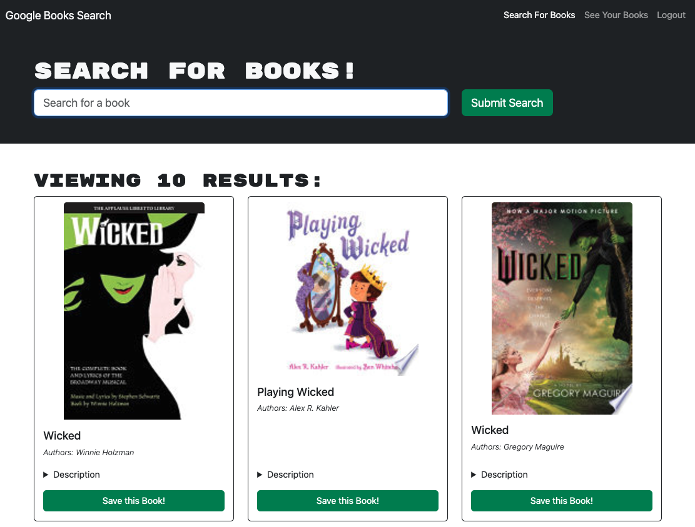
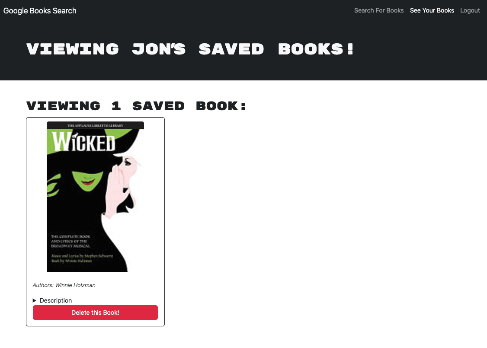

# book_search_engine_app

# 

 ## Table of Contents
  - [Links](#links)
  - [Description](#description)
  - [Installation](#installation)
  - [Usage](#usage)
  - [Contribution Guidelines](#contribution-guidelines)
  - [Testing](#testing)
  - [License](#license)

## Links
 Github link: https://github.com/IzzyFigueroa/book_search_engine_app
 Deployed link: https://book-search-engine-app-qxj6.onrender.com

 Please contact me at izzyfigueroa6@gmail.com

## Description
This is a README.md for the Book Search Engine Application. This is an application so that users can create an account, search for books and add them to their saved books. They can also delete books from their saved books.

## Images

## Installation
 Users just need to use url
## Usage
 Add books for saved files.

## Contribution Guidelines
 n/a
## Testing
 n/a

## License
This project is licensed under the terms of the MIT. For more information, please visit https://opensource.org/licenses/MIT.

